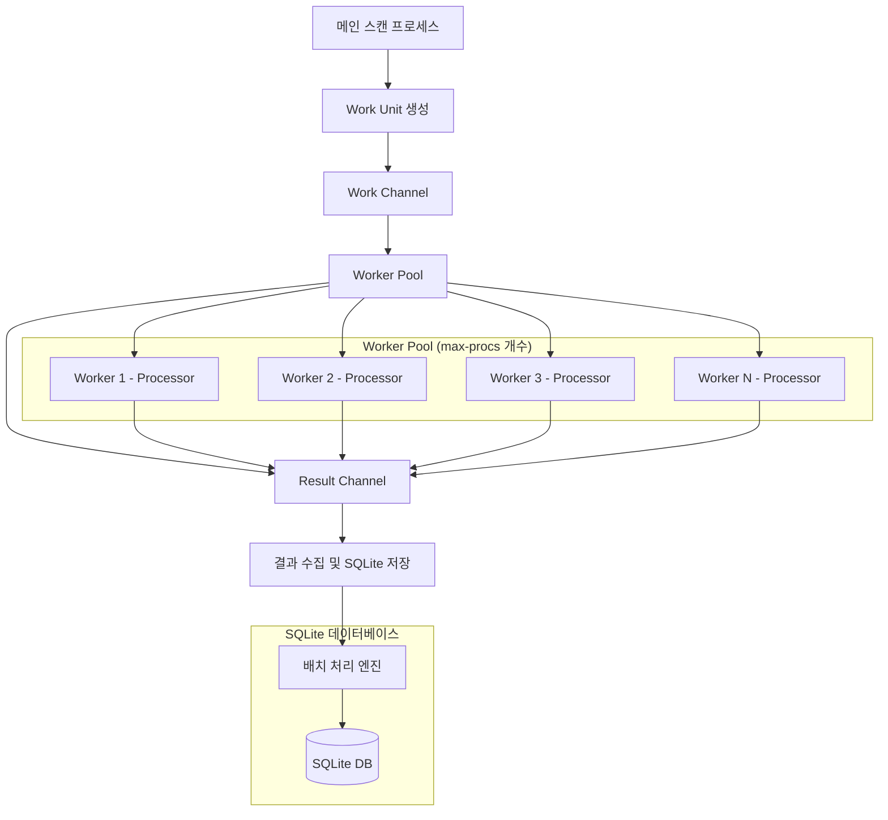
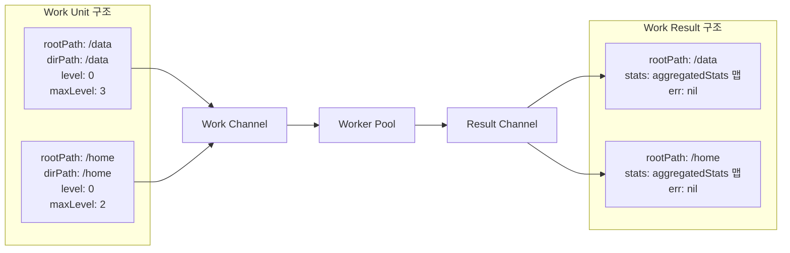
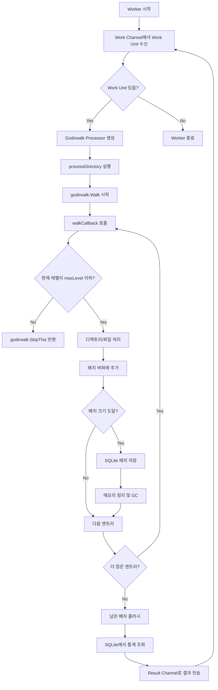
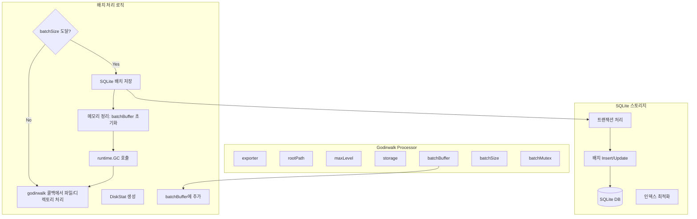

# Worker Pool 기반 디렉토리 스캔 아키텍처

## 개요

이 문서는 디스크 사용량 익스포터에서 사용하는 Worker Pool 기반의 디렉토리 스캔 아키텍처를 설명합니다. 이 아키텍처는 메모리 사용량을 최적화하고 CPU 코어 사용량을 제어하기 위해 설계되었습니다.

## 주요 특징

- **고정된 Worker 수**: `max-procs` 설정값에 따라 고정된 수의 Go 루틴 운영
- **SQLite 기반 스토리지**: 효율적인 배치 처리와 메트릭 저장을 위한 SQLite 데이터베이스 사용
- **Godirwalk 최적화**: 고성능 디렉토리 순회를 위한 godirwalk 라이브러리 활용
- **배치 처리**: 메모리 효율적인 배치 단위 데이터 처리
- **레벨 제한**: `dir-level` 설정에 따른 스캔 깊이 제한

## 아키텍처 다이어그램

### 1. 전체 시스템 구조



### 2. Work Unit 및 Channel 구조



### 3. Individual Worker 처리 흐름



### 4. Godirwalk Processor 내부 구조



## 설정 파라미터

### YAML 설정

```yaml
# CPU 코어 설정 - Worker 수 결정
max-procs: 12

# 디렉토리 레벨 제한
dir-level: 3

# SQLite 데이터베이스 설정
db-path: /tmp/disk-usage.db
batch-size: 1000
```

### 설정 설명

- **max-procs**: 동시에 실행될 Worker의 수를 결정
- **dir-level**: 스캔할 디렉토리 깊이 제한
- **db-path**: SQLite 데이터베이스 파일 경로
- **batch-size**: SQLite 배치 처리 단위 (기본값: 1000)

## 메모리 최적화 전략

### 1. Godirwalk 기반 처리
```go
// godirwalk 콜백을 통한 효율적인 디렉토리 순회
err := godirwalk.Walk(op.rootPath, &godirwalk.Options{
    Callback: op.walkCallback,
    ErrorCallback: func(osPathname string, err error) godirwalk.ErrorAction {
        log.Warnf("Failed to access %s: %v", osPathname, err)
        return godirwalk.SkipNode
    },
    Unsorted:            true, // Better performance for large directories
    FollowSymbolicLinks: op.exporter.followSymlinks,
})
```

### 2. 레벨 기반 조기 종료
```go
// maxLevel을 초과하는 디렉토리는 스캔하지 않음
if relativeLevel > op.maxLevel {
    if de.IsDir() {
        return godirwalk.SkipThis // Skip this directory and its children
    }
    return nil // Continue for files
}
```

### 3. 배치 처리 및 메모리 정리
```go
// 배치 처리 후 즉시 메모리 정리
func (op *processor) processBatchLocked() {
    if err := op.storage.StoreBatch(op.batchBuffer); err != nil {
        log.Errorf("Failed to store batch to SQLite: %v", err)
    }
    
    // Clear batch buffer and trigger memory cleanup
    op.batchBuffer = op.batchBuffer[:0] // Reset slice but keep capacity
    runtime.GC()                        // Suggest garbage collection
}
```

### 4. SQLite 기반 영구 저장
```go
// SQLite 배치 저장을 통한 메모리 효율성
func (s *sqliteStorage) StoreBatch(diskStats []DiskStat) error {
    tx, err := s.db.Begin()
    if err != nil {
        return err
    }
    defer tx.Rollback()
    
    // Batch insert/update operations
    for _, stat := range diskStats {
        // Insert or update statistics
    }
    
    return tx.Commit()
}
```

## 동시성 제어

### Worker Pool 생성
```go
// max-procs 개수만큼 Worker 생성
for i := 0; i < e.maxProcs; i++ {
    wg.Add(1)
    go e.streamingWorker(i, workChan, resultChan, &wg)
}
```

### 채널 기반 통신
- **Work Channel**: Worker들이 작업을 받아가는 버퍼드 채널
- **Result Channel**: Worker들이 결과를 전송하는 채널
- **WaitGroup**: 모든 Worker의 완료를 대기

### SQLite 동시성 처리
```go
// 각 Worker는 독립적인 processor 인스턴스 사용
func (e *Exporter) streamingWorker(workerID int, workChan <-chan workUnit, 
                                  resultChan chan<- workResult, wg *sync.WaitGroup) {
    defer wg.Done()
    
    for unit := range workChan {
        // 각 Worker마다 별도의 processor 생성
        processor := newProcessor(e, unit.rootPath, unit.maxLevel)
        err := processor.processDirectory()
        
        var stats map[string]*aggregatedStats
        if err == nil {
            stats = processor.getStats() // SQLite에서 통계 조회
        }
        
        resultChan <- workResult{
            rootPath: unit.rootPath,
            stats:    stats,
            err:      err,
        }
    }
}
```

## 성능 특성

### 기존 방식 vs Worker Pool + SQLite 방식

| 항목 | 기존 방식 | Worker Pool + SQLite 방식 |
|------|-----------|---------------------------|
| Go 루틴 수 | 스캔 경로 수만큼 | max-procs 개수 고정 |
| 메모리 사용량 | 전체 디렉토리 구조 | godirwalk + 배치 처리로 최적화 |
| CPU 사용량 | 제어 불가능 | max-procs로 제어 |
| 데이터 저장 | 메모리 기반 | SQLite 영구 저장 |
| 확장성 | 경로 수에 비례 | 설정으로 제어 가능 |
| 데이터 지속성 | 휘발성 | 영구 저장 |

### 메모리 사용량 특성
```
최적화된 메모리 사용량 = max-procs × (godirwalk 콜백 처리 비용 + 배치 버퍼 크기)
SQLite 저장으로 메모리 해제 후 재사용 가능
```

### SQLite 성능 최적화
- **배치 처리**: 1000개 단위 배치 Insert/Update
- **트랜잭션**: 배치 단위 트랜잭션으로 성능 향상
- **인덱스**: Path, Level 기반 복합 인덱스
- **WAL 모드**: Write-Ahead Logging으로 동시성 향상

## 사용 예시

### 설정 예시 1: 고성능 서버
```yaml
max-procs: 16      # 16개 Worker
dir-level: 4       # 깊은 스캔
db-path: /var/lib/disk-usage/metrics.db
batch-size: 2000   # 대용량 배치 처리
```

### 설정 예시 2: 메모리 제한 환경
```yaml
max-procs: 4       # 4개 Worker
dir-level: 2       # 얕은 스캔
db-path: /tmp/disk-usage.db
batch-size: 500    # 작은 배치 크기
```

### 설정 예시 3: 균형 잡힌 설정
```yaml
max-procs: 8       # 8개 Worker
dir-level: 3       # 중간 깊이
db-path: /opt/disk-usage/metrics.db
batch-size: 1000   # 기본 배치 크기
```

## 로그 출력 예시

```
[2025-08-01 14:16:17][INFO] Using 12 CPU cores for background scanning (godirwalk, folder-level processing)
[2025-08-01 14:16:17][INFO] SQLite storage configured at: /tmp/disk-usage.db (batch size: 1000)
[2025-08-01 14:16:17][DEBU] Worker 0 started
[2025-08-01 14:16:17][INFO] Worker 0: Starting scan for path: / (dir-level: 3)
[2025-08-01 14:16:17][DEBU] Starting analysis for path: / (maxLevel: 3)
[2025-08-01 14:16:17][DEBU] [Level 0] Directory processed: / (size: 4096 bytes, files: 25, subdirs: 18)
[2025-08-01 14:16:17][DEBU] Successfully stored batch of 1000 records to SQLite
[2025-08-01 14:16:18][DEBU] Completed analysis for path: / (dirs processed: 1547, files: 125000)
[2025-08-01 14:16:18][INFO] Worker 0: Completed scan for path: /, elapsed: 2.1s, stats: 1547
[2025-08-01 14:16:18][DEBU] Stored 1547 records to SQLite for path: /
[2025-08-01 14:16:18][INFO] Scan completed for path: /, stats: 1547, workers: 12
```

## 결론

Worker Pool + SQLite 기반 아키텍처는 다음과 같은 이점을 제공합니다:

1. **예측 가능한 리소스 사용**: max-procs로 CPU 사용량 제어, godirwalk + 배치 처리로 메모리 최적화
2. **데이터 지속성**: SQLite 기반 영구 저장으로 시스템 재시작 후에도 데이터 유지
3. **확장성**: 시스템 리소스에 맞춰 설정 조정 가능
4. **메모리 효율성**: 배치 처리 후 즉시 메모리 해제, GC 호출로 메모리 재사용
5. **안정성**: 고정된 Worker 수와 트랜잭션 기반 데이터 저장으로 시스템 안정성 향상
6. **성능 최적화**: WAL 모드, 인덱스, 배치 처리를 통한 SQLite 성능 최적화

### 핵심 개선사항

- **기존**: 메모리 기반 휘발성 저장 → **현재**: SQLite 기반 영구 저장
- **기존**: 스트리밍 처리 → **현재**: Godirwalk + 배치 처리
- **기존**: 단순 메모리 최적화 → **현재**: 메모리 + 디스크 I/O 최적화
- **기존**: 제한적 동시성 → **현재**: SQLite WAL 모드 기반 향상된 동시성

이 아키텍처를 통해 대용량 디렉토리 구조도 메모리 효율적이고 안정적으로 스캔할 수 있으며, 데이터의 영구 보존이 가능합니다.