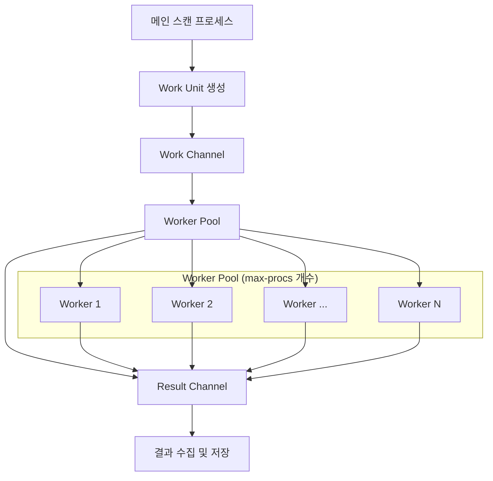
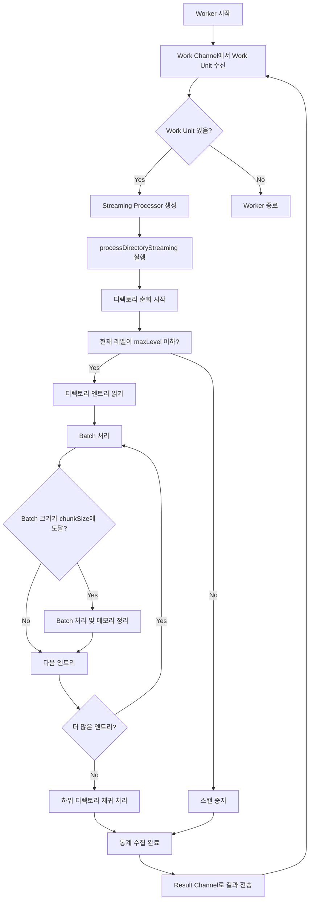

# Worker Pool 기반 디렉토리 스캔 아키텍처

## 개요

이 문서는 디스크 사용량 익스포터에서 사용하는 Worker Pool 기반의 디렉토리 스캔 아키텍처를 설명합니다. 이 아키텍처는 메모리 사용량을 최적화하고 CPU 코어 사용량을 제어하기 위해 설계되었습니다.

## 주요 특징

- **고정된 Worker 수**: `max-procs` 설정값에 따라 고정된 수의 Go 루틴 운영
- **메모리 제어**: `chunk-size` 설정을 통한 각 Worker의 메모리 사용량 제어
- **스트리밍 처리**: 대용량 디렉토리 구조를 메모리 효율적으로 처리
- **레벨 제한**: `dir-level` 설정에 따른 스캔 깊이 제한

## 아키텍처 다이어그램

### 1. 전체 시스템 구조



### 2. Work Unit 및 Channel 구조

```mermaid
graph LR
    subgraph "Work Unit 구조"
        WU1[rootPath: /data<br/>dirPath: /data<br/>level: 0<br/>maxLevel: 3]
        WU2[rootPath: /home<br/>dirPath: /home<br/>level: 0<br/>maxLevel: 2]
    end
    
    WU1 --> WC[Work Channel]
    WU2 --> WC
    
    WC --> WP[Worker Pool]
    
    WP --> RC[Result Channel]
    
    subgraph "Work Result 구조"
        WR1[rootPath: /data<br/>stats: map[string]*aggregatedStats<br/>err: nil]
        WR2[rootPath: /home<br/>stats: map[string]*aggregatedStats<br/>err: nil]
    end
    
    RC --> WR1
    RC --> WR2
```

### 3. Individual Worker 처리 흐름



### 4. Streaming Processor 내부 구조

```mermaid
graph TD
    subgraph "Streaming Processor"
        SP1[exporter *Exporter]
        SP2[rootPath string]
        SP3[maxLevel int]
        SP4[stats map[string]*aggregatedStats]
        SP5[statsMutex sync.RWMutex]
        SP6[batchSize int = chunkSize]
        SP7[currentBatch []streamingItem]
    end
    
    subgraph "배치 처리 로직"
        B1[파일/디렉토리 아이템 수집]
        B2[currentBatch에 추가]
        B3{batchSize 도달?}
        B3 -->|Yes| B4[processBatch 실행]
        B3 -->|No| B1
        B4 --> B5[통계 집계]
        B5 --> B6[메모리 정리: currentBatch 초기화]
        B6 --> B7[runtime.GC 호출]
        B7 --> B1
    end
    
    SP6 --> B3
    SP7 --> B2
```

## 설정 파라미터

### YAML 설정

```yaml
# CPU 코어 설정 - Worker 수 결정
max-procs: 12

# 청크 크기 설정 - 각 Worker의 메모리 사용량 제어
chunk-size: 1000

# 디렉토리 레벨 제한
dir-level: 3
```

### 설정 설명

- **max-procs**: 동시에 실행될 Worker의 수를 결정
- **chunk-size**: 각 Worker가 한 번에 처리할 파일/디렉토리 수 (메모리 사용량 제어)
- **dir-level**: 스캔할 디렉토리 깊이 제한

## 메모리 최적화 전략

### 1. 배치 처리
```go
// 설정된 chunk-size만큼 처리 후 즉시 메모리 정리
if len(sp.currentBatch) >= sp.batchSize {
    sp.processBatch()  // 통계 집계
    sp.currentBatch = sp.currentBatch[:0]  // 슬라이스 초기화
    runtime.GC()  // 가비지 컬렉션 제안
}
```

### 2. 조기 종료
```go
// maxLevel을 초과하는 디렉토리는 스캔하지 않음
if level > sp.maxLevel {
    log.Tracef("Skipping directory beyond maxLevel: %s (level: %d)", dirPath, level)
    return nil
}
```

### 3. 즉시 정리
```go
defer func() {
    // 스캔 완료 후 즉시 메모리 정리
    sp.currentBatch = nil
    sp.stats = nil
    runtime.GC()
}()
```

## 동시성 제어

### Worker Pool 생성
```go
// max-procs 개수만큼 Worker 생성
for i := 0; i < e.maxProcs; i++ {
    wg.Add(1)
    go e.streamingWorker(i, workChan, resultChan, &wg)
}
```

### 채널 기반 통신
- **Work Channel**: Worker들이 작업을 받아가는 버퍼드 채널
- **Result Channel**: Worker들이 결과를 전송하는 채널
- **WaitGroup**: 모든 Worker의 완료를 대기

## 성능 특성

### 기존 방식 vs Worker Pool 방식

| 항목 | 기존 방식 | Worker Pool 방식 |
|------|-----------|------------------|
| Go 루틴 수 | 스캔 경로 수만큼 | max-procs 개수 고정 |
| 메모리 사용량 | 전체 디렉토리 구조 | chunk-size로 제어 |
| CPU 사용량 | 제어 불가능 | max-procs로 제어 |
| 확장성 | 경로 수에 비례 | 설정으로 제어 가능 |

### 메모리 사용량 계산
```
예상 메모리 사용량 = max-procs × chunk-size × 평균_아이템_크기
```

## 사용 예시

### 설정 예시 1: 고성능 서버
```yaml
max-procs: 16      # 16개 Worker
chunk-size: 2000   # 높은 처리량
dir-level: 4       # 깊은 스캔
```

### 설정 예시 2: 메모리 제한 환경
```yaml
max-procs: 4       # 4개 Worker
chunk-size: 500    # 낮은 메모리 사용량
dir-level: 2       # 얕은 스캔
```

### 설정 예시 3: 균형 잡힌 설정
```yaml
max-procs: 8       # 8개 Worker
chunk-size: 1000   # 기본값
dir-level: 3       # 중간 깊이
```

## 로그 출력 예시

```
[2025-07-31 14:16:17][INFO] Using 12 CPU cores for streaming scanning (memory-optimized)
[2025-07-31 14:16:17][DEBU] Worker 0 started
[2025-07-31 14:16:17][INFO] Worker 0: Starting streaming scan for path: / (dir-level: 3)
[2025-07-31 14:16:17][DEBU] Starting streaming analysis for path: / (maxLevel: 3)
[2025-07-31 14:16:17][DEBU] [Level 0] Starting streaming scan: /
[2025-07-31 14:16:17][INFO] Worker 0: Completed streaming scan for path: /, elapsed: 2.5s, stats: 1547
[2025-07-31 14:16:17][INFO] Streaming scan completed for path: /, stats: 1547, workers: 12
```

## 결론

Worker Pool 기반 아키텍처는 다음과 같은 이점을 제공합니다:

1. **예측 가능한 리소스 사용**: max-procs와 chunk-size로 CPU와 메모리 사용량 제어
2. **확장성**: 시스템 리소스에 맞춰 설정 조정 가능
3. **메모리 효율성**: 스트리밍 처리와 배치 정리를 통한 메모리 최적화
4. **안정성**: 고정된 Worker 수로 시스템 안정성 향상

이 아키텍처를 통해 대용량 디렉토리 구조도 메모리 효율적으로 스캔할 수 있습니다.